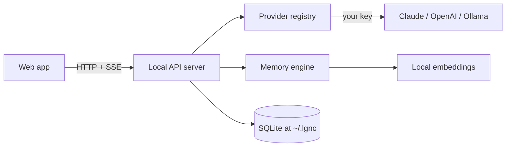

# LgNc

**Your personal assistant. Finally, an AI that's actually yours.**

LgNc lives on your machine, learns how you work, and gets better the longer you use it.
Open source. Self-hosted. Yours.

- **Local-first** — your conversations and memories live in a SQLite file on your own machine. Nothing is sent anywhere except the AI provider you explicitly choose.
- **Bring your own keys** — plug in your Anthropic (Claude) or OpenAI key, or run fully offline with [Ollama](https://ollama.com). Keys are encrypted at rest.
- **It learns you** — LgNc extracts durable facts and preferences from your chats, embeds them locally (no API key needed), and recalls what's relevant. You can view, edit, and delete everything it remembers.
- **Open source (MIT)** — read it, fork it, run it.

This repo is a TypeScript monorepo that builds into the web app today, and is structured to grow into desktop apps (macOS, Linux, Windows) via Tauri.

---

## Quick start

Requirements: **Node 20+** and **pnpm 9+**.

```bash
# 1. Install dependencies (builds a couple of native modules)
pnpm install

# 2. Start everything (local API server + web app)
pnpm dev
```

Then open **http://localhost:5173**.

On first run LgNc creates a data directory at `~/.lgnc` (the SQLite database and your
local encryption key). The web app talks to the local API server on port `8787`.

### Add a provider

Open **Settings** in the app and either:

- Paste an **Anthropic** or **OpenAI** API key, or
- Run a local model with Ollama:

  ```bash
  ollama serve
  ollama pull llama3.1
  ```

  LgNc auto-detects your installed Ollama models — no key required.

Pick a model from the dropdown in the chat header and start talking.

---

## How it works

```
apps/web      React + Vite UI (chat, settings, memory)
apps/server   Local Hono API (chat streaming, keys, memory, conversations)
packages/core providers (Claude/OpenAI/Ollama), memory engine, encryption
packages/db   SQLite schema + client (Drizzle ORM)
```



**The memory loop**: after each reply, LgNc asks the model to extract durable facts about
you, embeds them locally with a small on-device model
([all-MiniLM](https://huggingface.co/Xenova/all-MiniLM-L6-v2) via Transformers.js), and
stores them. On your next message it embeds the query, finds the most relevant memories,
and quietly adds them to the system prompt. If the local embedding model is unavailable,
it gracefully falls back to recent-memory recall.

---

## Tech stack

- **Monorepo**: pnpm workspaces + Turborepo
- **Frontend**: React, Vite, Tailwind CSS, TanStack Query, React Router
- **Backend**: Hono on Node, Server-Sent Events for streaming
- **AI**: [Vercel AI SDK](https://sdk.vercel.ai) (`@ai-sdk/anthropic`, `@ai-sdk/openai`, `ollama-ai-provider`)
- **Storage**: SQLite via Drizzle ORM (`better-sqlite3`)
- **Embeddings**: Transformers.js (runs locally, no key)

---

## Configuration

Copy `.env.example` to `.env` to tweak defaults (all optional):

| Variable            | Default                   | Description                                  |
| ------------------- | ------------------------- | -------------------------------------------- |
| `SERVER_PORT`       | `8787`                    | Port for the local API server                |
| `LGNC_DATA_DIR`     | `~/.lgnc`                 | Where the SQLite DB and secret key live      |
| `OLLAMA_BASE_URL`   | `http://localhost:11434`  | Your local Ollama server                     |
| `ANTHROPIC_API_KEY` | —                         | Optional: seed a key via env instead of the UI |
| `OPENAI_API_KEY`    | —                         | Optional: seed a key via env instead of the UI |

Keys you add in the app are encrypted with AES-256-GCM using a machine-local key
(`~/.lgnc/secret.key`) and are only ever sent to the provider you select.

---

## Scripts

```bash
pnpm dev        # run web + server together
pnpm build      # build all packages and the web app
pnpm typecheck  # typecheck the whole monorepo
pnpm db:migrate # initialize the local database
```

---

## Privacy

- Your chats and memories are stored only in your local SQLite database.
- The only outbound network calls are to the AI provider you choose (or none at all, with Ollama).
- Delete everything any time: remove the `~/.lgnc` directory, or clear individual memories in the Memory page.

---

## Roadmap

- Desktop apps via Tauri (macOS, Linux, Windows) wrapping this same web UI
- Tools / function calling and file + document ingestion (RAG)
- More providers and local model management

Contributions welcome — see [CONTRIBUTING.md](CONTRIBUTING.md).

## License

[MIT](LICENSE) © LgNc contributors
